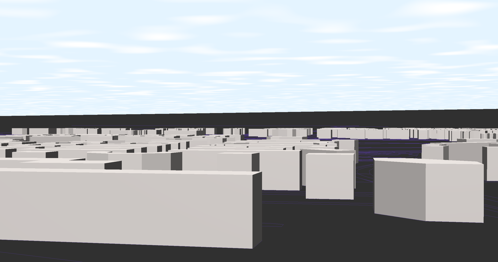

# OpenStreetMap Rendering using OpenGL

current overview: 

achieved: 

- simple cloud using perlin noise
- xml file read and construct Vertices
- building rendering

todo lists: 

- volumetric cloud using ray marching
- text render
- road and subways render